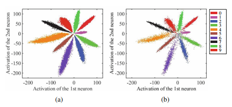
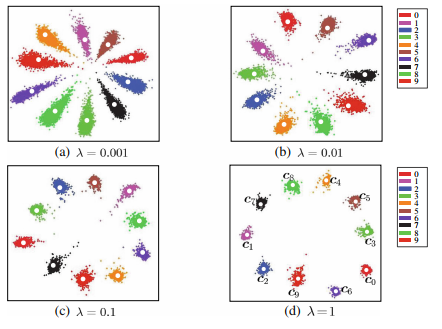
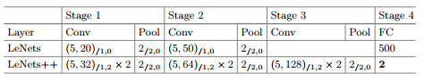

- This project used to reproduce the [A Discriminative Feature Learning Approach for Deep Face Recognition](http://xueshu.baidu.com/s?wd=paperuri%3A%28eae5294beb88f58b16a60904eac4661f%29&filter=sc_long_sign&tn=SE_xueshusource_2kduw22v&sc_vurl=http%3A%2F%2Flink.springer.com%2Fcontent%2Fpdf%2F10.1007%2F978-3-319-46478-7_31.pdf&ie=utf-8&sc_us=11158090530192800971)
- First, we realize the effect on MNIST
    - 
    - 
    - 
    - the first picture show the result with only softmax loss, the second picture show the result with softmax loss and center loss.
    - the third picture show the model used to train.